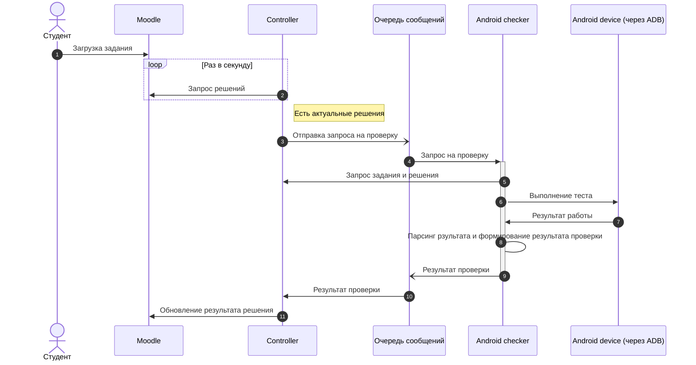
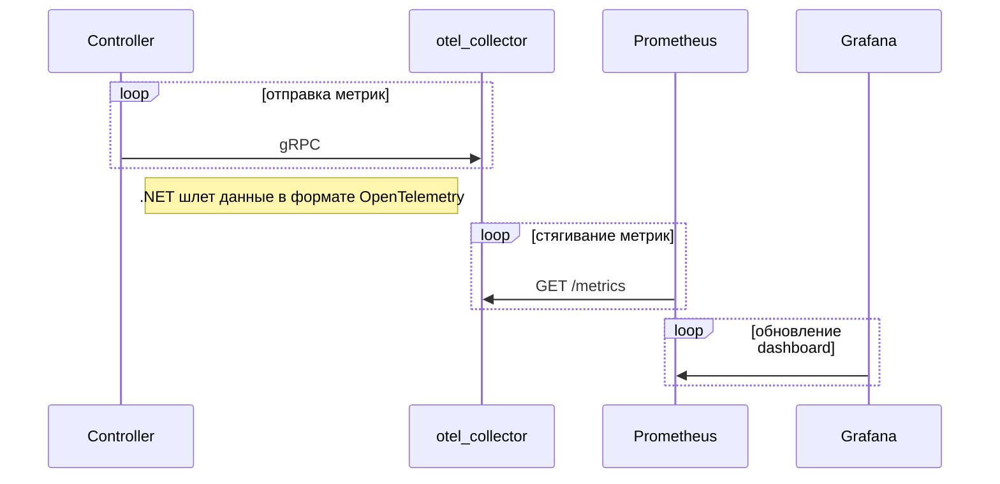

## Требования
- JDK 11+ (при наличии нескольких необходимо установить переменную окружения JAVA_HOME на корректную версию)

```mermaid
sequenceDiagram
    autonumber
    actor Студент

    Студент ->> Moodle: Загрузка задания
    loop Раз в секунду
      Controller ->> Moodle: Запрос решений
    end
    note right of Controller: Есть актуальные решения
    Controller -) Очередь сообщений: Отправка запроса на проверку
    Очередь сообщений ->> +Android checker: Запрос на проверку
    Android checker ->> Controller: Запрос задания и решения
    Android checker ->> Android device (через ADB): Выполнение теста
    Android device (через ADB) ->> Android checker: Результат работы
    Android checker -> Android checker: Парсинг рзультата и формирование результата проверки
    Android checker -) -Очередь сообщений: Результат проверки
    Очередь сообщений ->> Controller: Результат проверки
    Controller ->> Moodle: Обновление результата решения

```

## Метрики

```mermaid
sequenceDiagram
    participant Controller
    participant otel_collector
    participant Prometheus
    participant Grafana
    link otel_collector: Docs @ https://opentelemetry.io/docs/collector/
    link Prometheus: Docs @ https://prometheus.io/
    link Grafana: Docs @ https://grafana.com
    loop отправка метрик
        Controller ->> otel_collector: gRPC
    end
    Note right of Controller: .NET шлет данные в формате OpenTelemetry
    loop стягивание метрик
      Prometheus ->> otel_collector: GET /metrics
    end
    loop обновление dashboard
      Grafana ->> Prometheus: 
    end
```

# **TODO** описать метрики, их теги
